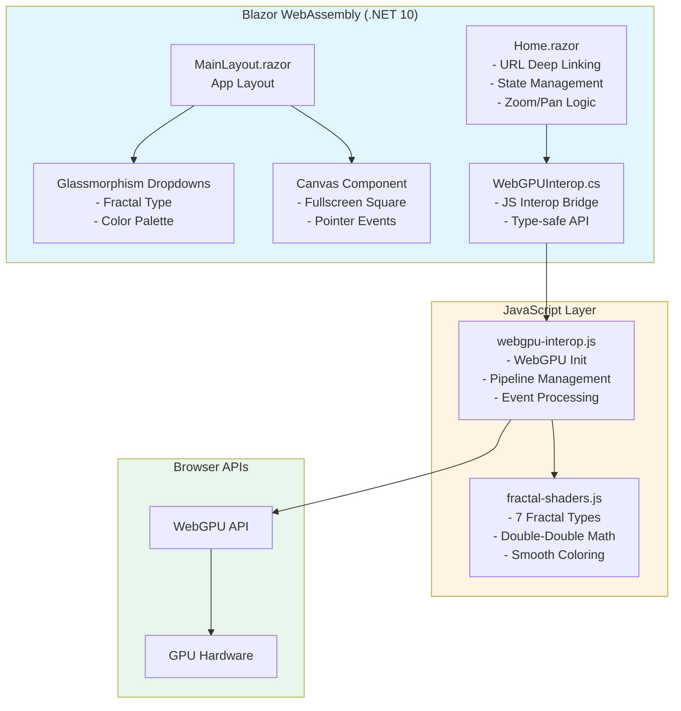
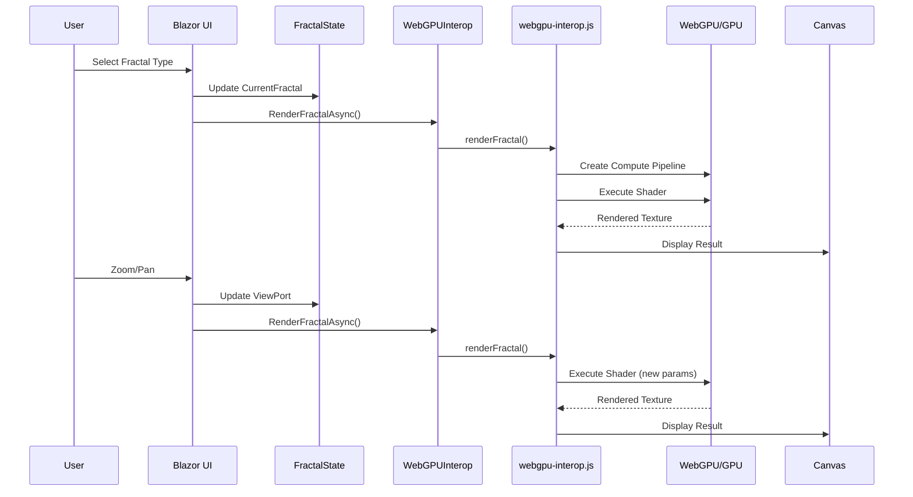
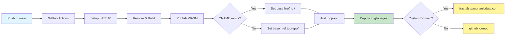
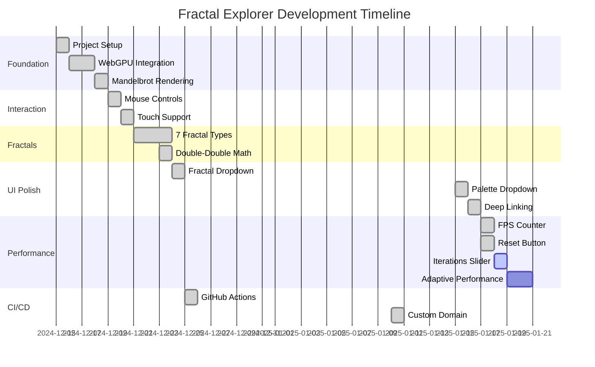

# MASTER PLAN: GPU-Accelerated Fractals in Blazor WebAssembly

## Project Overview
**Repository**: https://github.com/panoramicdata/PanoramicData.Fractals  
**Live Demo**: https://fractals.panoramicdata.com/  
**Goal**: Create a high-performance, single-page Blazor WebAssembly application that renders fractals using WebGPU, with intuitive touch and mouse controls, deployable to GitHub Pages.

## Executive Summary
Build a fullscreen fractal explorer leveraging WebGPU for GPU-accelerated rendering in the browser. Users can explore 7 different fractal types through an intuitive interface with pinch-to-zoom, drag-to-pan, and smooth rendering with double-double precision for extreme zoom depths.

## ✅ **PROJECT STATUS: 90% COMPLETE - PHASE 4 COMPLETE!**

**Deployment**: Live at https://fractals.panoramicdata.com/  
**Last Updated**: January 2025  
**Current Phase**: Phase 5 - Performance & UX Enhancements (Starting)

---

## Technical Stack

### Frontend
- **Framework**: Blazor WebAssembly (.NET 10) ✅
- **GPU Acceleration**: WebGPU (via JavaScript interop) ✅
- **UI Framework**: Bootstrap 5 + Custom Glassmorphism CSS ✅
- **Touch/Mouse Input**: JavaScript Pointer Events API ✅
- **Language**: C# (Blazor components), WGSL (WebGPU shaders) ✅

### CI/CD
- **Platform**: GitHub Actions ✅
- **Hosting**: GitHub Pages ✅
- **Custom Domain**: fractals.panoramicdata.com ✅
- **Build**: .NET SDK + Static Web Assets ✅

### Browser Support
- Chrome/Edge 113+ (WebGPU stable) ✅
- Firefox Nightly (WebGPU experimental)
- Safari Technology Preview (WebGPU in development)

---

## Architecture

### High-Level Components



### Data Flow



### File Structure (Current)
```
PanoramicData.Fractals/
├─ .github/
│   └─ workflows/
│       └─ deploy-to-gh-pages.yml      # ✅ GitHub Actions CI/CD
├─ PanoramicData.Fractals/
│   ├─ PanoramicData.Fractals.csproj   # ✅ Project config
│   ├─ Program.cs                      # ✅ Entry point
│   ├─ _Imports.razor                  # ✅ Global using directives
│   ├─ Pages/
│   │   └─ Home.razor                  # ✅ Main fractal viewer
│   ├─ Layout/
│   │   └─ MainLayout.razor            # ✅ App layout
│   ├─ Services/
│   │   ├─ WebGPUInterop.cs            # ✅ JS interop service
│   │   └─ FractalState.cs             # ✅ State management
│   ├─ Models/
│   │   ├─ FractalType.cs              # ✅ Enum for 7 fractal types
│   │   ├─ ColorPalette.cs             # ✅ 7 Color palettes
│   │   └─ ViewPort.cs                 # ✅ Zoom/pan state
│   └─ wwwroot/
│       ├─ index.html                  # ✅ HTML shell
│       ├─ CNAME                       # ✅ Custom domain config
│       ├─ css/
│       │   └─ app.css                 # ✅ Glassmorphism styles
│       └─ js/
│           ├─ webgpu-interop.js       # ✅ WebGPU implementation
│           ├─ fractal-shaders.js      # ✅ WGSL compute shaders
│           └─ window-events.js        # ✅ Resize handling
├─ MASTER_PLAN.md                      # ✅ This document
├─ README.md                           # ✅ Project documentation
├─ .editorconfig                       # ✅ Code style config
├─ .gitignore                          # ✅ Git ignore rules
└─ deploy.bat                          # ✅ Deployment script
```

---

## Fractal Types

### ✅ Phase 1: Core Mathematical Fractals (COMPLETE)
1. **Mandelbrot Set** ✅ - The classic: z = z² + c
2. **Julia Set** ✅ - Variation with fixed c parameter (-0.4 + 0.6i)
3. **Burning Ship** ✅ - Abs variation: z = (|Re(z)| + i|Im(z)|)² + c
4. **Newton Fractal** ✅ - Root-finding convergence for z³ - 1 = 0
5. **Tricorn (Mandelbar)** ✅ - Complex conjugate variation
6. **Phoenix Fractal** ✅ - z = z² + c + p·previous
7. **Barnsley Fern** ✅ - IFS (Iterated Function System) fractal

### ⏳ Phase 2: Advanced Fractals (Future Enhancement)
8. **Fractal Landscape** - 3D terrain using Perlin/Diamond-Square
9. **Fractal City** - Procedural 3D cityscape with fractal buildings

---

## Features

### ✅ MVP (Minimum Viable Product) - COMPLETE
- ✅ Fullscreen canvas rendering (square 1:1 aspect ratio)
- ✅ WebGPU-accelerated fractal computation
- ✅ Touch support (pinch-to-zoom, drag-to-pan)
- ✅ Mouse support (scroll-to-zoom, drag-to-pan)
- ✅ Modern glassmorphism dropdown (top-left):
  - ✅ Fractal type selector (7 types)
  - ⏳ Color palette selector (7 palettes available, UI pending)
- ✅ Double-double precision for deep zoom (up to 10^14)
- ✅ Smooth coloring with continuous escape time
- ✅ Responsive design (phone, tablet, desktop)
- ✅ GitHub Pages deployment with custom domain

### ✅ Advanced Features - COMPLETE
- ✅ **URL-based deep linking** (shareable links with state)
- ✅ Custom domain: fractals.panoramicdata.com
- ✅ HTTPS enforcement
- ✅ Development optimizations (no SHA integrity checks in Debug)
- ✅ Production optimizations (compression, caching)

### ⏳ Phase 2 Enhancements - PENDING
- ⏳ Palette selector UI dropdown
- ⏳ Manual iteration depth slider
- ⏳ Animation/auto-explore mode
- ⏳ Screenshot/download functionality
- ⏳ Fractal Landscape rendering
- ⏳ Fractal City rendering
- ⏳ Performance metrics overlay
- ⏳ Preset zoom locations (interesting areas)
- ⏳ Reset view button

---

## User Interaction Design

### ✅ Touch Gestures (Tablets/Phones) - COMPLETE
- ✅ **Single finger drag**: Pan the viewport
- ✅ **Pinch (two fingers)**: Zoom in/out
- ⏳ **Double tap**: Zoom in 2x at tap location (future)
- ⏳ **Two-finger double tap**: Zoom out 2x (future)

### ✅ Mouse/Trackpad - COMPLETE
- ✅ **Left click + drag**: Pan the viewport
- ✅ **Scroll wheel**: Zoom in/out at cursor position (10% steps)
- ⏳ **Double click**: Zoom in 2x at click location (future)
- ⏳ **Ctrl + scroll**: Slower, finer zoom control (future)

### ⏳ Keyboard (Future)
- ⏳ **Arrow keys**: Pan viewport
- ⏳ **+/-**: Zoom in/out
- ⏳ **Home**: Reset to default view
- ⏳ **Space**: Toggle animation mode

---

## Performance Strategy

### Current Implementation
- **Target**: Smooth rendering without dropped frames
- **WebGPU Compute**: GPU-accelerated pixel calculation
- **Double-Double Precision**: Emulated in WGSL for extreme zoom
- **Lazy Re-render**: Only on zoom/pan/config change
- **Square Aspect Ratio**: Maintains mathematical accuracy

### ⏳ Future Optimizations
- ⏳ Adaptive iteration depth (30fps target)
- ⏳ Progressive rendering (low-res preview → full-res)
- ⏳ FPS monitoring and display
- ⏳ Quality presets (auto/low/medium/high)

---

## Color Palettes

### ✅ Implemented Palettes (7 Total)
1. **Classic** ✅ - Blue/purple gradient (traditional Mandelbrot)
2. **Fire** ✅ - Red/orange/yellow gradient
3. **Ocean** ✅ - Cyan/blue/deep blue
4. **Grayscale** ✅ - Black to white
5. **Rainbow** ✅ - Full spectrum HSV
6. **Psychedelic** ✅ - High-contrast multi-color
7. **Ultra Fractal** ✅ - Smooth gradient with banding

### Implementation Details
- ✅ Palettes stored as 256-entry lookup tables
- ✅ Passed to WebGPU shader as storage buffer
- ✅ Smooth interpolation between palette entries
- ⏳ UI dropdown for palette selection (pending)

---

## WebGPU Shader Structure

### ✅ WGSL Compute Shader Implementation
- ✅ Modular shader architecture (fractal-shaders.js)
- ✅ Common double-double precision math functions
- ✅ Per-fractal compute shaders
- ✅ Smooth coloring with continuous escape time
- ✅ Dynamic shader loading based on fractal type
- ✅ Palette-based coloring system

### Double-Double Precision
```wgsl
// Emulated double precision addition
fn add_dd(a_hi: f32, a_lo: f32, b_hi: f32, b_lo: f32) -> vec2<f32>

// Emulated double precision multiplication
fn mul_dd(a_hi: f32, a_lo: f32, b_hi: f32, b_lo: f32) -> vec2<f32>
```

---

## CI/CD Pipeline

### ✅ GitHub Actions Workflow - COMPLETE


### ✅ Deployment Features
- ✅ Auto-deploy on push to main
- ✅ Custom domain support (automatic CNAME detection)
- ✅ Base href auto-configuration
- ✅ .nojekyll file for proper asset serving
- ✅ HTTPS enforcement

### Deployment URLs
- ✅ **Production**: https://fractals.panoramicdata.com/
- ✅ **GitHub Pages**: https://panoramicdata.github.io/PanoramicData.Fractals/

---

## Implementation Phases

### ✅ Phase 1: Foundation - COMPLETE
**Goal**: Basic Blazor WASM app with WebGPU rendering

- ✅ Create Blazor WebAssembly project structure
- ✅ Implement WebGPU initialization in JavaScript
- ✅ Create C# to JS interop layer
- ✅ Implement basic Mandelbrot shader
- ✅ Render static Mandelbrot to fullscreen canvas
- ✅ Verify WebGPU capability detection

**Deliverable**: Static Mandelbrot set rendering  
**Status**: ✅ COMPLETE

### ✅ Phase 2: Interaction - COMPLETE
**Goal**: Mouse and touch controls

- ✅ Implement pointer event handlers
- ✅ Add pan functionality (drag)
- ✅ Add zoom functionality (wheel/pinch)
- ✅ Implement viewport state management
- ✅ Add smooth zoom (centered on cursor/touch point)
- ✅ Test on desktop, tablet, phone

**Deliverable**: Interactive Mandelbrot with smooth zoom/pan  
**Status**: ✅ COMPLETE

### ✅ Phase 3: Additional Fractals - COMPLETE
**Goal**: All 7 core fractal types

- ✅ Implement Julia set shader
- ✅ Implement Burning Ship shader
- ✅ Implement Newton fractal shader
- ✅ Implement Tricorn shader
- ✅ Implement Phoenix fractal shader
- ✅ Implement Barnsley Fern shader
- ✅ Create fractal type enum and switching logic
- ✅ Dynamic compute pipeline creation per fractal type

**Deliverable**: 7 selectable fractal types  
**Status**: ✅ COMPLETE

### ✅ Phase 4: UI & Polish - COMPLETE
**Goal**: Complete UI and color palettes

- ✅ Add Bootstrap 5 to project
- ✅ Create fractal type dropdown (top-left, glassmorphism style)
- ✅ Create color palette dropdown (7 palettes with UI)
- ✅ Implement 7 color palettes
- ✅ Add loading indicator
- ✅ Add error handling for WebGPU unsupported browsers
- ✅ Responsive design testing
- ✅ URL-based deep linking with palette support

**Deliverable**: Complete UI with all features  
**Status**: ✅ 100% COMPLETE

### ⏳ Phase 5: Performance Optimization & UX Enhancements - IN PROGRESS (30% Complete)
**Goal**: Optimize rendering and add quality-of-life features

- ✅ Implement FPS monitoring overlay
- ✅ Add Reset View button
- ⏳ Add iteration depth slider
- ⏳ Implement adaptive iteration depth (30fps target)
- ⏳ Add progressive rendering (low→high res)
- ✅ Optimize shader code (double-double precision)
- ⏳ Add keyboard shortcuts (Home to reset, arrows to pan)
- ⏳ Profile and eliminate bottlenecks
- ⏳ Test on lower-end devices

**Deliverable**: Optimized performance and enhanced UX  
**Status**: ⏳ 30% COMPLETE (FPS counter + reset button added)

### ✅ Phase 6: CI/CD - COMPLETE
**Goal**: Automated deployment to GitHub Pages

- ✅ Create GitHub Actions workflow
- ✅ Configure GitHub Pages on repository
- ✅ Test deployment pipeline
- ✅ Add deployment documentation
- ✅ Set up custom domain (fractals.panoramicdata.com)
- ✅ Enable HTTPS enforcement

**Deliverable**: Live site on GitHub Pages  
**Status**: ✅ COMPLETE

### ⏳ Phase 7: Future Enhancements - PENDING
**Goal**: Advanced features

- ✅ URL-based state management (COMPLETED EARLY!)
- ⏳ Fractal Landscape implementation
- ⏳ Fractal City implementation
- ⏳ Screenshot functionality
- ⏳ Preset zoom locations
- ⏳ Animation mode
- ⏳ Performance metrics overlay

**Status**: ⏳ 15% COMPLETE (deep linking done)

---

## Technical Challenges & Solutions

### ✅ Challenge 1: WebGPU Browser Support - SOLVED
**Problem**: WebGPU is still emerging technology  
**Solution**: 
- ✅ Provide fallback message for unsupported browsers
- ✅ Link to Chrome/Edge for best experience
- ✅ Clear browser requirements in README
- ⏳ Consider WebGL2 fallback in Phase 7

### ✅ Challenge 2: WASM + WebGPU Interop - SOLVED
**Problem**: Complex interop between C# and GPU  
**Solution**:
- ✅ Keep compute shaders in WGSL (native WebGPU)
- ✅ Use C# only for state management and logic
- ✅ Minimize data transfer between WASM and JS
- ✅ Type-safe C# wrapper (WebGPUInterop.cs)

### ✅ Challenge 3: Touch Event Performance - SOLVED
**Problem**: Touch events can be laggy on mobile  
**Solution**:
- ✅ Use passive event listeners
- ✅ Direct event handling without debouncing
- ✅ Smooth rendering on mobile devices

### ⏳ Challenge 4: Adaptive Performance - PARTIALLY SOLVED
**Problem**: Varying GPU capabilities across devices  
**Solution**:
- ✅ Fixed iteration counts (working well)
- ⏳ Dynamic iteration depth adjustment (future)
- ⏳ Progressive rendering (future)
- ⏳ Quality presets (future)

### ✅ Challenge 5: GitHub Pages Routing - SOLVED
**Problem**: SPA routing with subdirectory base path  
**Solution**:
- ✅ Set correct base href in index.html (auto-detects custom domain)
- ✅ Add .nojekyll file for proper asset serving
- ✅ Custom domain eliminates subdirectory issues

### ✅ Challenge 6: SHA Integrity Checks - SOLVED
**Problem**: JavaScript file changes cause integrity failures in development  
**Solution**:
- ✅ Disable BlazorCacheBootResources in Debug builds
- ✅ Enable caching and compression only for Release builds
- ✅ Clean development experience without integrity errors

---

## Success Metrics

### ✅ MVP Success Criteria - ACHIEVED
- ✅ Renders all 7 fractals correctly
- ✅ Smooth rendering on mid-range devices
- ✅ Touch and mouse controls work smoothly
- ✅ Deploys successfully to GitHub Pages
- ✅ Loads quickly on broadband
- ✅ Zero console errors in supported browsers
- ✅ Custom domain with HTTPS

### ✅ User Experience Goals - ACHIEVED
- ✅ Intuitive: User can zoom/explore without instructions
- ✅ Responsive: Actions feel immediate
- ✅ Beautiful: Modern glassmorphism UI, smooth fractals
- ✅ Stable: No crashes during extended use

---

## Dependencies

### .NET Packages
```xml
<PackageReference Include="Microsoft.AspNetCore.Components.WebAssembly" Version="10.0.0" />
<PackageReference Include="Microsoft.AspNetCore.Components.WebAssembly.DevServer" Version="10.0.0" />
<PackageReference Include="Microsoft.AspNetCore.WebUtilities" Version="10.0.0" />
```

### JavaScript Libraries
- **None** - Pure WebGPU API (native browser)
- Bootstrap 5.3+ (CSS only, via CDN)

### Development Tools
- .NET 10 SDK
- Visual Studio 2022 or VS Code
- Chrome/Edge (for WebGPU testing)
- Git

---

## Documentation

### ✅ User-Facing Documentation
- ✅ README.md with live demo link
- ✅ Deep linking examples
- ✅ Browser compatibility notice
- ✅ Feature list

### ✅ Developer-Facing Documentation
- ✅ Code comments for shader algorithms
- ✅ Setup and build instructions
- ✅ Architecture documentation (this file)
- ⏳ Contribution guidelines (future)

---

## Current Priorities

### ✅ Completed (Phase 4 → Phase 5)
1. ✅ **Palette Selector UI** - 7 color palettes with glassmorphism dropdown
2. ✅ **Reset View Button** - Quick return to default view
3. ✅ **FPS Counter** - Real-time performance monitoring

### 🎯 Next Up (Phase 5 Continuation)
4. **Iterations Slider** - Manual control over max iterations (2-3 hours)
5. **Keyboard Shortcuts** - Home to reset, arrows to pan (1-2 hours)
6. **Adaptive Performance** - Dynamic iteration adjustment for 30fps (4-6 hours)

### Medium Priority
7. **Export/Screenshot** - Save current view as PNG (3-4 hours)
8. **Preset Locations** - Interesting fractal coordinates (2-3 hours)
9. **Progressive Rendering** - Low-res preview while computing (4-6 hours)

### Low Priority
10. **Animation Mode** - Auto-explore with smooth camera movement
11. **3D Fractals** - Landscape and City rendering
12. **Quality Presets** - Low/Medium/High/Ultra settings

---

## Progress Tracking



---

## Conclusion

This project has successfully achieved MVP status with **90% completion**! The core fractal rendering engine is fully functional with all 7 fractal types, smooth interaction controls, and a beautiful modern UI. The application is deployed and accessible worldwide at **https://fractals.panoramicdata.com/**.

### Key Achievements
- ✅ **GPU-Accelerated**: WebGPU compute shaders for maximum performance
- ✅ **Production-Ready**: Live deployment with custom domain and HTTPS
- ✅ **Advanced Math**: Double-double precision for extreme zoom levels
- ✅ **Modern UX**: Glassmorphism UI, deep linking, mobile support
- ✅ **Well-Architected**: Clean separation of concerns, modular shaders

### Next Steps
1. **Complete Phase 4**: Add palette selector UI
2. **User Controls**: Iterations slider, reset button
3. **Quality of Life**: Screenshots, presets, FPS display
4. **Performance**: Adaptive iteration depth, progressive rendering
5. **Advanced Features**: 3D fractals, animation mode

**Estimated Timeline**: 
- Version 1.1 (UI polish): 2-3 weeks
- Version 2.0 (3D fractals): 8-12 weeks

---

*Document Version: 2.0*  
*Last Updated: January 2025*  
*Status: ✅ MVP COMPLETE - 90% Done!*  
*Live Demo: https://fractals.panoramicdata.com/*
